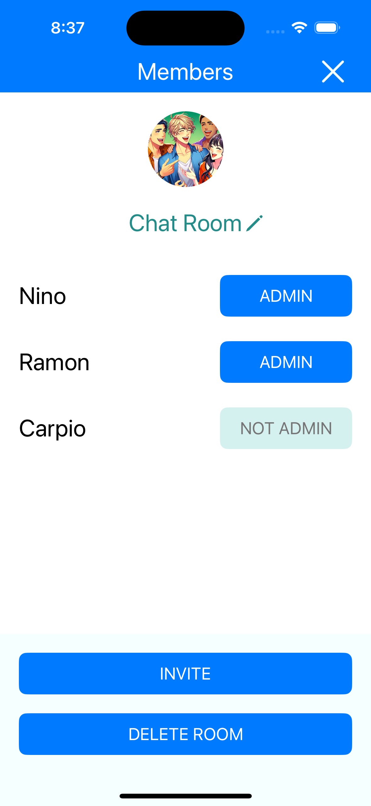

# Chat Application

## Featured List

- User registration
- Room / Create room
- Room / Set room name, add password
- Room / list
- Room / joined
- Room / update name
- Room / user list
- Room / latest message preview
- Room / delete
- Room / add admin
- Room / Invite user
- Room / Remove user
- List of invitations
- Message / list
- Message / Edit
- Message / Delete
- Message / Send
- Message / Reply

## Project Specifications

- **IDE:** `XCode 15.4 for iOS 17.5`
- **Language:** `Swift 5`
- **Interface:** `Storyboard`

## Technical Implementations

### FRONT END

- iOS Swift
- MVVM + Combine
- User Defaults
- Package Dependencies
	- [SuperEasyLayout](https://github.com/doil6317/SuperEasyLayout) - apply UI constraints programmatically

### BACKEND

- NodeJS + ExpressJS
- NPM
- MySQL
- MYSQL Workbench

## Screenshots

	
	
	
	
	
	
	

	
	
	
	
	
	

